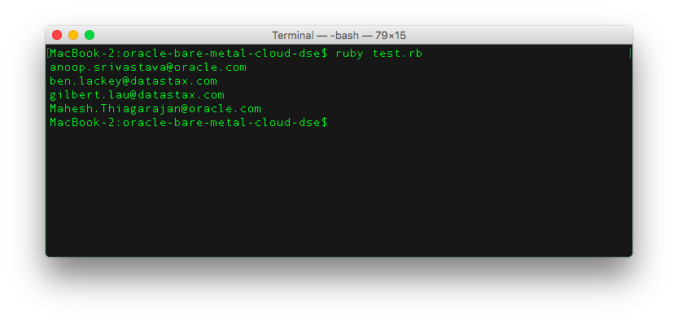
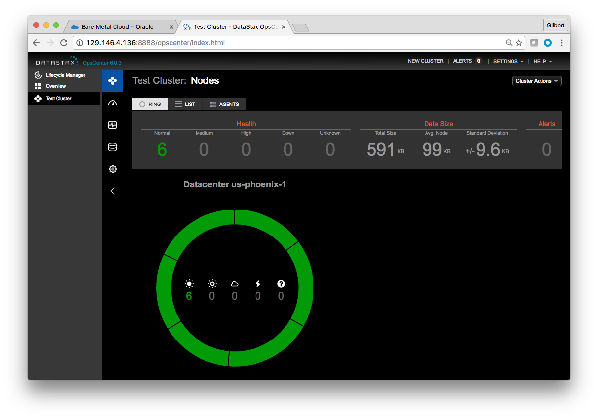

# oracle-bare-metal-cloud-dse
Scripts and instructions to deploy DataStax Enterprise (DSE) to Oracle Bare Metal Cloud

## Prerequisites

You will need to install the Ruby SDK for Oracle Bare Metal Cloud.

Login to https://console.us-az-phoenix-1.oracleiaas.com/#/a/  The Ruby SDK is available [here](https://docs.us-phoenix-1.oraclecloud.com/Content/API/Concepts/sdks.htm).  Doc is available at [here](https://docs.us-az-phoenix-1.oracleiaas.com/tools/ruby/latest/frames.html).  Download the SDK and install it using the command:

```
gem install oraclebmc-0.8.0.gem
```

You will now need to create a config file for the SDK as detailed in the [documentation](https://docs.us-az-phoenix-1.oracleiaas.com/tools/ruby/latest/index.html#label-Configuring+the+SDK).  The default location and file name of the config file are \<your home directory\>/.oraclebmc and config respectively.

Next download our git project as follows:

```
git clone https://github.com/DSPN/oracle-bare-metal-cloud-dse
cd oracle-bare-metal-cloud-dse
```

You can now run this command to verify your setup:

    ruby test.rb

It should return a list of users belonging to your Oracle Bare Metal Cloud tenancy like the following:



## Deploying DataStax Enterprise cluster and DataStax OpsCenter

At this point, you are all set to go to run the following script to deploy your DataStax Enterprise cluster and DataStax OpsCenter.  You will need to pass in three arguments to the script:

* Compartment ID
* Number of nodes in each Availability Domain
* Your SSH public key's full file path name

```
./deploy.rb <compartment_id> <number of nodes> <ssh_key_full_path_name>
```

Now you can sit back and relax.  The whole process will take about 15 to 20 minutes long depending on the number of nodes to deploy.  You can now go back to the Oracle BareM Metal Cloud console to check if all your nodes are up and running.  Once 10 to 15 minutes have passed, you can try to point your browser at port 8888 of the public IP address of node named "DataStax_Node_plus_OpsCenter".  If the OpsCenter is still not yet available, you can refresh your browser every couple minutes.  Initially, you might see the cluster containing only one DSE node.  You will gradually see more nodes coming up as they are being provisioned.



## Testing the Cluster

Now you can ssh into one of your DSE cluster nodes and try running [Cassandra Stress](https://docs.datastax.com/en/cassandra/3.x/cassandra/tools/toolsCStress.html) as follows:

```
cassandra-stress write n=1000000 cl=QUORUM -rate threads=50 -mode native cql3 user=cassandra password=cassandra -node <any DSE node internal IP address>  -schema "replication(factor=3)"
```

## Deleting the Cluster and its associated virtual cloud network

To delete the cluster, login to Oracle Bare Metal Cloud console and click "terminate" on each node and the virtual cloud network named "ds_vcn_network" which was created as part of your DSE cluster deployment.
