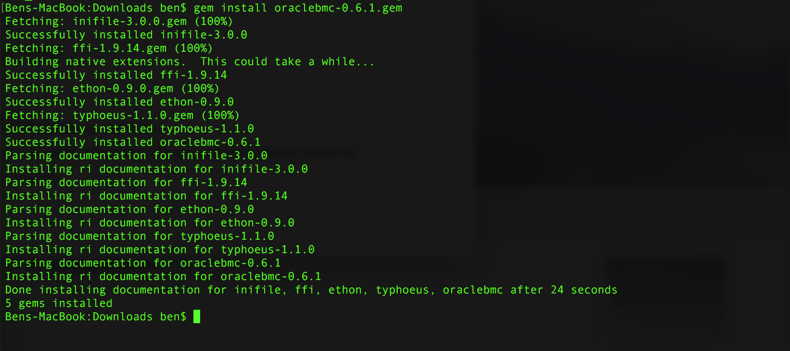

# oracle-bare-metal-cloud-dse
Scripts to deploy DSE to Oracle Bare Metal Cloud

## Prerequisites

You will need to install the Oracle Bare Metal Cloud Ruby SDK.

Login to https://console.us-az-phoenix-1.oracleiaas.com/#/a/  The Ruby SDK is available [here](https://docs.us-az-phoenix-1.oracleiaas.com/tools/ruby/latest/download/oraclebmc-0.6.1.gem).  Doc is available at [here](https://docs.us-az-phoenix-1.oracleiaas.com/tools/ruby/latest/frames.html).  Download the SDK and install it using the command:

    gem install oraclebmc-0.6.1.gem

If all went well you should see:

